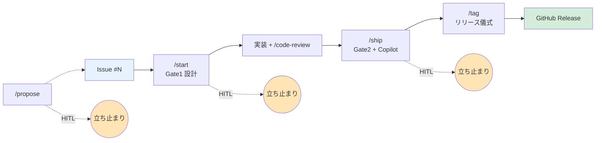

# gh-issue-driven

[](https://github.com/JFK/gh-issue-driven/releases)
[](https://github.com/JFK/gh-issue-driven/actions/workflows/lint.yml)
[](LICENSE)

[English](README.md) | **日本語**

> **GitHub issue 駆動開発のフルライフサイクルワークフロー: セッションコンテキストからの `propose` → 設計ゲート付き `start` → advisor + Copilot ゲート付き `ship`（全フェーズ境界に HITL 確認）→ リリース儀式自動化 `tag`。マルチ issue バッチ、プラガブル事後レビュア、per-repo Kagura Memory 自動検出付き。**

`gh-issue-driven` は [Claude Code](https://claude.com/claude-code) のプラグインで、「issue #142 の作業を始める」を 1 本の再現可能な 3 フェーズワークフローに変えます:



1. **`/gh-issue-driven:start <issue...>`** — issue を取得、Kagura Memory から関連する過去ナレッジを recall、**gate 1**(設計レビュー、`/claude-c-suite:ask` → 必要なら `/ceo` にエスカレーション)を実行、型付きフィーチャーブランチを作成し、実装フェーズへハンドオフ。複数 ID を渡すとバッチブランチを作成。
2. _(あなたがコードを書き、ビルトインの `/code-review` で diff をレビュー)_
3. **`/gh-issue-driven:ship`** — **gate 2**(デフォルトは `cso` + `qa-lead` + `cto` advisor 並列実行。`gate2.binary_gate` で optional なバイナリゲート追加可能)、PR 作成、**プラガブルな事後レビューループ**(Copilot / `code-review:code-review` プラグイン / both — `review.provider` で設定可能)を自動実行。Copilot ループに入る直前で **HITL 確認ゲート** が立ち止まり、このPRでループを起動するかを聞きます。
4. **`/gh-issue-driven:tag <version>`** — リリース儀式: milestone の closed issues をラベルごとにグルーピングしてリリースノート生成、`plugin.json` + `marketplace.json` の version bump、`CHANGELOG.md` 更新、コミット、annotated tag、`--follow-tags` で push、GitHub Release 作成。`dry-run` ですべてを事前プレビュー可能(ファイル・git・GitHub を一切触らない)。

ワークフロー全体は `kagura-memory` の `session-start` / `session-summary` で挟まれ、初回実行時は **context 自動検出**で設定不要。issue ごとの学びが永続化されます。

> 📖 **設計思想を読む**: [Qiita 記事 — Issue→Release を自動化したら、逆に人間が重要になった話](https://qiita.com/kiyotaman/items/302c8b7dc2cbcec555ff) · [スライド資料](https://docs.google.com/presentation/d/1eVUJLepOofN5bJUC7GBK7grPgTqRdfge5Ft9izaK8k4/edit)

---

## 60秒クイックスタート

```text
# ステップ0 — リポジトリの GitHub Settings ページで一度だけ:
#   Settings → Code review → ☑ Automatic Copilot code review
#   URL: https://github.com/<owner>/<repo>/settings/code-review
#   これを有効にすると、Copilot レビューループが gh CLI のバージョンに依存せず動く。
#   有効化しない場合は gh CLI >= 2.88.0 が必要 (下記「必要なバージョン」参照)。

# Claude Code セッション内 — プラグイン install:
/plugin marketplace add JFK/gh-issue-driven
/plugin install gh-issue-driven

# 推奨 companion プラグイン (無くても degrade して動作)
# 注: install target の `@<marketplace>` は marketplace.json の name フィールド (GitHub repo slug ではない)

/plugin marketplace add JFK/claude-c-suite-plugin    # gate1 + gate2 レビュア
/plugin install claude-c-suite@claude-c-suite

/plugin marketplace add kagura-ai/memory-cloud       # session-start/summary + recall
/plugin install kagura-memory@kagura-memory-cloud

# Optional (v0.2 の深掘りレビュー用):
/plugin marketplace add JFK/claude-phd-panel-plugin
/plugin install claude-phd-panel@claude-phd-panel

# 任意のリポジトリで:
/gh-issue-driven:doctor          # 初回環境チェック (ステップ0 の確認 prompt も走る)
/gh-issue-driven:start 142       # フェーズ1（単一 issue）
/gh-issue-driven:start 4 12 20   # 複数 issue を1ブランチにまとめることも可能
# ... 実装、その後 /code-review で diff レビュー ...
/gh-issue-driven:ship            # フェーズ2 (gate2 + Copilot ループ)
# ... PR が main にマージされ、milestone が release ready になったら ...
/gh-issue-driven:tag 0.3.0 dry-run   # フェーズ3 プレビュー
/gh-issue-driven:tag 0.3.0           # フェーズ3 実行 (リリース儀式)
```

> **ステップ0 が必要な理由**: GitHub の "Automatic Copilot code review" リポジトリ設定を有効にすると、PR 作成時と push のたびに Copilot レビューが自動で要求されるため、gh CLI のバージョンに関係なくループが自走します。有効化していない場合、プラグインは `gh pr edit --add-reviewer @copilot` にフォールバックしますが、これは `gh < 2.88.0` で **silent に no-op します** ([#15](https://github.com/JFK/gh-issue-driven/issues/15) 参照)。`/gh-issue-driven:doctor` は repo ごとに7日間隔でステップ0 の確認 prompt を出し、どちらのモードも使えない場合は hard fail します。

---

## コマンド一覧

| コマンド | フェーズ | 動作 |
|---|---|---|
| `/gh-issue-driven:start <issue...> [flags]` | 1 | issue 取得、gate 1、ブランチ作成。複数 ID でバッチ対応。フラグ: `dry-run`, `force`, `no-memory`, `--branch=<name>` |
| `/gh-issue-driven:ship [flags]` | 2 | gate 2、PR 作成、HITL ゲート、Copilot ループ、session 保存。フラグ: `dry-run`, `force`, `no-copilot`, `draft` |
| `/gh-issue-driven:review [flags]` | 2 | open 済み PR に対して事後レビューループを再実行 (Copilot / `/code-review` / both)。re-entrant 設計。フラグ: `dry-run`, `force` |
| `/gh-issue-driven:tag <version> [flags]` | 3 | リリース儀式: リリースノート生成、manifest bump、`CHANGELOG.md` 更新、commit、annotated tag、push、GitHub Release 作成。フラグ: `dry-run`, `force`, `--notes-file=<path>` |
| `/gh-issue-driven:propose <description> [flags]` | 0 | issue の下書きと作成: dedup チェック、品質レビュー、PM エンリッチメント、HITL 確認。フラグ: `dry-run`, `force` |
| `/gh-issue-driven:doctor [verbose\|fix]` | — | read-only な環境健康診断 |
| `/gh-issue-driven:config [show\|init\|path\|<key>]` | — | 実効設定の表示、テンプレート初期化 |
| `/gh-issue-driven:status [<branch>\|all\|proposals]` | — | カレントブランチ(または全ブランチ/提案一覧)の state 表示 |

---

## 3 フェーズの仕組み

### Phase 1 — `/gh-issue-driven:start`(Gate 1: 設計レビュー)

issue 取得と recall の **後**、ブランチ作成の **前** に走ります。戦略：

1. まず `/claude-c-suite:ask`（単一視点ルータ）を呼ぶ。軽量・高速で、専門1分野で済む issue に最適。
2. `/ask` 応答内で最後に出現した `## Verdict:` 行のトークンが `decline` の場合、`/claude-c-suite:ceo` に昇格して3視点 synthesis を実行。（`decline` は同じ `## Verdict:` 行で使われる gate1 専用トークンであり、別チャネルではない。応答本文に "decline" や "escalate" という単語が出てきても、それはレビュアの推論の一部であり routing シグナルではない — 構造化された verdict 行のみがカウントされる。）
3. レビュアの応答末尾の `## Verdict: green|yellow|red` 行から verdict を解析する。構造化行が canonical で last-wins、case は正規化、末尾の句読点は許容。キーワードヒューリスティックは構造化行が無い場合の **fallback のみ** で、warn ログを emit して soft-deprecation の追跡が可能。
4. **green** → HITL 確認ゲート（ブランチ作成前にユーザー確認。`gate1.green_continue_requires_confirm` で設定可、デフォルト `true`） / **yellow** → ユーザー確認 / **red** → abort（`force` で override 可）

### Phase 2 — `/gh-issue-driven:ship`(Gate 2: PR 作成直前のレビューバッテリー + Copilot ループ)

実装の **後**、PR 作成の **前** に走ります。デフォルトでは **3つの advisor reviewer** が 1ターン内で並列発火 (advisor-only mode)：

| レビュア | 役割 | verdict 型 |
|---|---|---|
| `/claude-c-suite:cso` | セキュリティ | Advisory（`green`/`yellow`/`red`） |
| `/claude-c-suite:qa-lead` | テスト網羅 | Advisory |
| `/claude-c-suite:cto` | 技術負債 | Advisory |

3つの advisor verdict が集約される：いずれか red → red、yellow → yellow、それ以外 green。verdict handling は gate1 と同じ (green → HITL 確認ゲートで PR 作成前にユーザー確認、`gate2.green_continue_requires_confirm` で設定可、デフォルト `true` / yellow → 確認 / red → abort、`force` で override)。

#### Optional binary gate (default off)

「fail なら `force` でも block されるハードバイナリゲート」が欲しいプラグインメンテナは、`~/.claude/gh-issue-driven-config.json` の `gate2.binary_gate` に skill 名を設定できます：

```json
{
  "gate2": {
    "binary_gate": "/claude-c-suite:audit"
  }
}
```

設定すると、その skill が advisor 3つに加えて 4つ目のレビュアとして並列発火し、その verdict (`pass`/`fail`) がハードリリースゲートとして読まれる。

デフォルトは `null` (binary gate なし)。以前のバージョンは `/claude-c-suite:audit` がデフォルトだったが、これは `claude-c-suite-plugin` 自身の規約遵守チェッカーであり、他のプラグイン (gh-issue-driven 含む) では script が存在せずエラーで終わる → 全 `/ship` invocation を block していた。v0.1.1 (#26) で修正。

### Phase 3 — `/gh-issue-driven:tag`(リリース儀式)

PR が default branch にマージされ、milestone の準備が整った後に実行します。儀式は「**すべてのチェックをファイル変更の前に寄せる**」構造になっているため、どこかで失敗しても作業ツリーはクリーンなままです:

1. **Pre-flight**: default branch にいるか? 作業ツリーはクリーンか? remote と同期しているか?
2. **Milestone readiness**: 指定バージョンに対応する milestone に open issues が残っていないか(残っている場合は `force` で警告付き続行)。
3. **Lint + tests**: `check-frontmatter.py` と `tests/*.sh` がファイル変更前に走る。
4. **リリースノート生成**: milestone の closed issues をラベルでグルーピング(`bug` → "Bug Fixes"、`enhancement` → "Enhancements" など `tag.label_group_map` で設定可)、"Full Changelog" 比較リンク付き。
5. **Manifest bump**: `.claude-plugin/plugin.json` と `.claude-plugin/marketplace.json` を Edit tool で更新(traceability のため sed は使わない)。2 ファイルが bump 前から非同期な場合は abort。
6. **CHANGELOG.md 更新**: 先頭に日付付きエントリを prepend、GitHub Release ページへリンク。
7. **Commit**: `chore: release v<version>`(リリース3ファイルのみ stage)。
8. **Annotated tag**: `git tag -a v<version>`(annotated が必須 ― `--follow-tags` は lightweight tag を拾わない)。
9. **Push**: `git push --follow-tags origin <default_branch>` で commit と tag を一緒に送信、partial-failure window を閉じる。
10. **GitHub Release 作成**: `gh release create v<version> --notes-file ...` で生成したノートを使用。

`dry-run` フラグで各ステップの効果(リリースノート完全版、manifest diff、CHANGELOG 追加行、git コマンド列)を事前プレビューできます ― ファイル・git・GitHub を一切触りません。このコマンドは **default branch に push する唯一のコマンド** です(他のコマンドは全て default branch への push を禁止しています)。

`git push` が branch protection で拒否された場合、コマンドはループや再試行をしません。代わりに、ローカルに作成済みの commit と tag を保持したまま、**リカバリワークフロー** (短命ブランチ経由の PR で version bump をマージする手順)を表示します ― 作業を失わず、destructive ステップを再実行しません。

### Verdict 行の規約

レビュアの skill は、応答末尾に最終的な `## Verdict:` 行を出力すること。トークンは次のいずれか：

- `## Verdict: green`
- `## Verdict: yellow`
- `## Verdict: red`
- `## Verdict: decline`  &nbsp;&nbsp;— gate1 (`/ask`) のみ、routing 昇格シグナル
- `## Verdict: pass`  &nbsp;&nbsp;— `/audit` のみ
- `## Verdict: fail`  &nbsp;&nbsp;— `/audit` のみ

（応答中に複数の `## Verdict:` 行が現れた場合は last-wins が適用される — 下記ルール参照。）

ルール：

- **構造化行が canonical**。`gh-issue-driven` はこの行を最優先で解釈する。
- **last-wins**: 応答中に複数行ある場合、最後の出現が勝つ（"最初は red と思ったが結局 green" のような自然な記述に対応）。
- **case insensitive**: `Green` / `green` / `GREEN` はすべて `green` に正規化される。
- **末尾の句読点 OK**: `## Verdict: green.` のような形式も `\b<token>\b` で許容される。
- **キーワードヒューリスティックは fallback のみ**: 構造化行が無い場合だけ走る。fallback したときは `verdict_parser=heuristic` という warn ログを emit するので、ヒューリスティック完全廃止 (v0.4) の判断材料として追跡可能。
- **`decline` は gate1 routing 専用トークン**: 別チャネルではない。本文中に "decline" の単語が出ても、それは routing シグナルではなくレビュアの推論。

`claude-c-suite` / `claude-phd-panel` などの reviewer skill を保守している場合、この行を出力するように改修すれば統合がよりクリーンになる。

---

## 並行開発 (`--worktree`)

`/gh-issue-driven:start <issue> --worktree` は、in-place で checkout する代わりに、新しい feature branch を別の [git worktree](https://git-scm.com/docs/git-worktree) の中に作成します。これによりメインの作業ディレクトリを `main`(または別の feature branch)のままにしつつ、新しい branch での実装を別ディレクトリで並行して進められます。(`start` は issue identifier を先に解釈し、続くトークンを flag として解釈するので、`--worktree` は必ず issue の *後* に置きます。)

### 1 つのフラグに 2 系統のパス

- **`superpowers` プラグインが入っている場合**: `superpowers:using-git-worktrees` に委譲されます。smart directory selection によって、通常はリポジトリ外の sibling path に worktree が配置されます。
- **入っていない場合**: フォールバックとしてリポジトリ内の `.worktrees/<branch>` に作成します。このディレクトリは `/.worktrees/` エントリで gitignore しておく想定で、`/gh-issue-driven:doctor fix` を実行すると `/.worktrees/` 追記用の `try:` コマンドが表示されます(doctor 自身は read-only でファイル編集は一切しないため、オペレータが手動で実行します)。`--branch=<override>` と併用すると `.worktrees/<override>` に配置されます。

どちらのパスでも、`start` の recap に `cd <worktree-path>` のヒントが表示されるので、次のシェルプロンプトで正しい作業ディレクトリに移動できます。

### ライフサイクル ― merge 後の後片付け

PR が merge されても worktree は自動削除されません。merge して `main` を pull したあと、以下を実行してください:

```bash
git worktree remove <worktree-path>
git worktree prune   # 古い登録情報の掃除
```

先にディレクトリを `rm -rf` してしまった場合(推奨しません)は、`git worktree prune` だけで dangling 登録を解消できます。

### `--worktree` を使うか、superpowers を直接呼ぶか

- **`start --worktree` を使う**: このプラグインの 3 フェーズフロー (`start → ship → tag`) に worktree を紐付けたいとき。branch 名・state file・gate1 サマリが全て新 branch 用に揃います。
- **`superpowers:using-git-worktrees` を直接呼ぶ**: このプラグインとは無関係に worktree が欲しいとき (任意 branch のレビュー、実験など) — state file も gate1 review も走りません。

---

## Token 効率化フラグ (`auto-size`, `auto-skip`, `--with-plan`, `--parallel`)

`/start` と `/ship` には、作業の実態に応じて cascade を軽量化する opt-in フラグがあります。フラグ未指定時の挙動は v0.8.0 と byte-identical です。

### `auto-size` — small issue で gate1 を完全スキップ (`/start`)

`/gh-issue-driven:start <issue> auto-size` で **issue-size heuristic** を起動。primary issue のラベルが `gate1.size_heuristic.small_labels` (デフォルト: `good first issue`, `documentation`, `docs`, `tests`, `i18n`) に一致するか、本文が `small_body_max_chars` (デフォルト 500 字) 未満なら、gate1 は **完全にスキップ** されます。`/claude-c-suite:ask` も `/ceo` 昇格も走りません。state file には `gate1.reviewer="size-heuristic"` と synthetic verdict markdown が記録されます。

HITL 確認ゲートは引き続き発火するので、「I have feedback」でスキップを上書き可能。batch invocation (`/start 4 5 6`) は決して small 扱いされません — bundling 自体が coherence signal だからです。

毎回 `/start` でデフォルト ON にしたい場合は `~/.claude/gh-issue-driven-config.json` の `gate1.size_heuristic.enabled: true` に設定。

### `auto-skip` — 関係ない gate2 advisor をスキップ (`/ship`)

`/gh-issue-driven:ship auto-skip` は diff を調べ、変更ファイル**すべて**が `gate2.diff_scope_skip.docs_only_patterns` (デフォルト `README*` / `CHANGELOG*` / `CONTRIBUTING*` / `docs/` / `.github/`) に一致したら、`docs_only_skip_advisors` (デフォルト `cso` と `qa-lead`) をスキップします。残りの advisor (例: `cto`) は走り、binary gate (`gate2.binary_gate`) は影響を受けません。

1ファイルでも非doc 変更があれば docs-only 判定は不成立 — partial skip はありません。このリポジトリの `commands/*.md` は markdown-as-code (実行 spec) なので、意図的にデフォルトパターンから除外されています。

永続化設定は `gate2.diff_scope_skip.enabled: true`。

### `--with-plan` — gate1 後に実装プランを生成 (`/start`)

`/gh-issue-driven:start <issue> --with-plan` で、gate1 verdict 後・branch 作成前に `superpowers:writing-plans` を起動。plan markdown は会話から取得され、`~/.claude/cache/gh-issue-driven/<branch-flat>.plan.md` に永続化、state file の `plan.path` が pointer になります。

`superpowers` プラグインが必要。未インストール時は warning を出して plan なしで継続 (abort しません)。

plan は `/start` 会話の **in-line で生成** されます — `/claude-c-suite:ask` や `/kagura-memory:session-start` と同じ実行モデルで、autonomous な sub-process は存在しません。

### `--parallel` — subagent dispatch で実装 (`/start`)

`/gh-issue-driven:start <issue> --with-plan --parallel` で plan 生成後に `superpowers:subagent-driven-development` をチェーン: step 18 の continue target が「plan を入力として subagent dispatch を起動」になります (`/feature-dev:feature-dev` 起動や conversation 内 plan 起案の代わり)。

`--parallel` は `--with-plan` を要求します (subagent skill は plan を input として消費する仕様)。`--parallel` 単独は明示エラーで弾きます。

### こんなときは使わない

- **`auto-size` + 複雑 issue**: グローバルに `auto-size` を ON にして heuristic が複雑 issue を small と誤判定した場合、gate1 はそのままスキップされます。HITL gate が safety net なので、override して再実行可能。
- **`auto-skip` + security-sensitive docs**: `docs/` に脅威モデルなど security review 必須の文書がある場合は default `false` のまま、必要 PR で `cso` を手動で追加。
- **`--parallel` + 些細な変更**: subagent dispatch には setup コストがあります。1ファイルの fix なら conversation 内 continue target (「plan を起案」) の方が安価。

---

## Copilot レビューループ

`gh pr create` の後、`/gh-issue-driven:ship` はレビュアの add を発火し、polling loop に入る前に **HITL 確認ゲート** で立ち止まります(v0.3.0 以降):

```text
Copilot review on PR #<num>
https://github.com/<owner>/<repo>/pull/<num>

Is Copilot review running on this PR?
  1) Yes, it's running (or I triggered it another way)
  2) No, skip the review loop for this run
  3) Retry — let me trigger it now (I'll press Yes when ready)
```

Copilot が `--add-reviewer` の呼び出しを実際に受理したかどうか、プラグイン側からは検証できません ― org 権限、Copilot の課金/ポリシー、Mode A トグル、手動のコメントメンション経由の trigger、draft PR の不安定さなど、API で問い合わせ不能な要因が多いためです。検出マトリクスを肥大化させる代わりに、プラグインはあなたに聞きます。PR が draft の場合、draft PR の不安定性についての注意書きも prompt で表示され、事前に No を選んで promote してから再実行できます。

**Yes** を選ぶと、polling loop に入ります(デフォルト **最大 5 回**、設定可):

1. Copilot の新しい activity を待つ(`gh pr view --json reviews,comments,reviewDecision` を 60秒ごとに poll、最大 15 分)。
2. 最新レビューと新しい bot コメントをパース。
3. **終了条件**: `approved` / `no_actionable_feedback` / `max_loops` / `tests_failed` / `silent_no_op` (「confirmed されたが反応が無い」という真の anomaly を意味し、catch-all ではない)。
4. actionable なコメントを `Edit` / `Bash` で適用。nit は skip。
5. `copilot.run_tests_after_edits` が true ならローカルテスト実行。
6. `fix: address Copilot review (loop N)` で commit、push、レビュー再依頼。

**No** を選ぶと、state ファイルに `exit_reason="hitl_declined"` を書き、PR を draft のままにして loop を clean に skip します。準備ができたら(例: Web UI で Copilot を trigger した後、draft から promote した後)、`/gh-issue-driven:review` で loop を再実行できます ― decline は「今回は skip」の意味であり「二度と聞くな」ではないため、ゲートは再度 prompt します。

**Retry** を選ぶと、同じ prompt が即座に再表示されます。プラグインは poll も wait もしません ― あなた自身のペースで Copilot を trigger し、準備ができたら Yes を押してください。

ループは **never-blocking**: 5 周使い切っても PR は開いたまま、残りは手動で対応します。

### HITL ゲートの無効化

`~/.claude/gh-issue-driven-config.json` で `copilot.hitl_confirm_invocation: false` を設定すると、v0.3.0 以前の動作(prompt なしで `--add-reviewer` 発火後そのまま loop 開始)に戻せます。CI や非対話環境で operator が prompt に応答できない場合に有用です。

### 必要なバージョン (どちらか一方)

Copilot ループには **2つの動作モード**があり、**どちらか一方**が成立していればループが end-to-end で動きます:

- **Mode A (推奨)** — リポジトリ設定で `Settings → Code review → ☑ Automatic Copilot code review` を有効化。**任意の `gh` CLI バージョンで動く**。Copilot が PR 作成時と push のたびに自動で要求される。
- **Mode B** — `gh` CLI **v2.88.0 以降** ([2026年3月の Changelog](https://github.blog/changelog/2026-03-11-request-copilot-code-review-from-github-cli/) で追加された本物の `--add-reviewer @copilot` サポート)。それ以前の `gh` バージョンでは手動 reviewer add が silent に no-op する ([#15](https://github.com/JFK/gh-issue-driven/issues/15) 参照)。

両モード共通: リポジトリのプランで GitHub Copilot code review 機能が利用可能であること。

### Web UI による手動フォールバック

Mode A を有効化できず、`gh` も 2.88.0+ にアップグレードできない場合:

1. プラグインが PR を作成した後、HITL ゲートが prompt を出します。
2. GitHub Web UI で PR を開く → Reviewers → "Copilot" をクリック。
3. HITL prompt が再表示されたら **Yes** を押す(または先に **Retry** を選んで Copilot を trigger してから Yes を押す)。

---

## クロスプラグイン Skill 呼び出しの契約

このプラグインは他プラグインのスラッシュコマンドを **Skill ツール経由で skill として呼び出します**。各ゲートのコマンド本文に明示的に書かれています：

> Invoke `/claude-c-suite:ask` via the Skill tool, passing the prompt block built in step N as input.

並列レビュアの場合 (gate2 で invoke する skill 数は `gate2.binary_gate` の設定で変わる):

> In a single tool-call batch, invoke gate2 reviewer skills in parallel via the Skill tool. **デフォルト (advisor-only mode、`gate2.binary_gate: null`)**: 3 advisor skill — `/claude-c-suite:cso`, `/claude-c-suite:qa-lead`, `/claude-c-suite:cto`。**`gate2.binary_gate` が skill 名 (例: `/claude-c-suite:audit` for plugin maintainers) に設定されている場合**: 4 skill — configured binary gate skill + 3 advisor。

skill が見つからない場合の degrade：
- advisor reviewer missing → そのゲートスロットは `unknown`、警告を出して継続
- binary gate skill missing (`gate2.binary_gate` 設定時のみ該当) → `unknown` 扱い、`force` で続行可
- `gate2.binary_gate` が `null` (デフォルト) → binary gate なし、advisor-only mode、`force` 不要
- `kagura-memory` missing → recall と session-start/summary をスキップ (`memory.context_id` resolution 失敗時は warning 1行を出す)

`/gh-issue-driven:doctor` で何が入っているか確認できます。

---

## 設定

デフォルトはバンドル済み。`~/.claude/gh-issue-driven-config.json` で上書き可能：

```bash
/gh-issue-driven:config init      # テンプレート書き出し（既存があれば上書きしない）
/gh-issue-driven:config show      # 実効設定表示
/gh-issue-driven:config path      # ファイルパス表示
/gh-issue-driven:config copilot.max_loops   # 単一値表示
```

主な設定：

| キー | デフォルト | 備考 |
|---|---|---|
| `default_branch` | `main` | base ブランチ |
| `memory.context_id` | `null` (auto-detect) | Kagura Memory の recall 用コンテキスト。`null` (repo ごとに auto-detect)、`owner/repo` をキーとした **dict** (例: `{"JFK/gh-issue-driven": "<uuid>", "*": "<uuid>"}` — `"*"` は wildcard fallback)、または legacy scalar (UUID / name) を受け付ける。初回 `/start` 時にそのリポジトリ用のコンテキストを選択/作成するプロンプトが出て、dict のそのリポジトリのキーに永続化される。詳細は `/gh-issue-driven:config show`。 |
| `gate1.primary` | `/claude-c-suite:ask` | gate1 の最初のレビュア |
| `gate1.fallback` | `/claude-c-suite:ceo` | decline 時のエスカレーション先 |
| `gate1.green_continue_requires_confirm` | `true` | green verdict 時にブランチ作成前で HITL 確認。`false` でスキップ |
| `gate2.binary_gate` | `null` (off) | optional な override 不可バイナリゲート。skill 名 (例: `/claude-c-suite:audit`) を設定すると有効化 |
| `gate2.green_continue_requires_confirm` | `true` | green verdict 時に PR 作成前で HITL 確認。`false` でスキップ |
| `gate2.advisors` | `[cso, qa-lead, cto]` | 並列実行・集約 |
| `copilot.max_loops` | `5` | 最大ループ数 |
| `copilot.poll_interval_sec` | `60` | poll 間隔 |
| `copilot.max_wait_sec` | `900` | 1ループあたりの最大待機時間 |
| `copilot.run_tests_after_edits` | `true` | Copilot 修正後にローカルテスト実行 |

### Copilot レビューループの最適化

Copilot ループは設定なしで動作しますが、以下の2つのオプション設定でレビューの往復を約50%削減できます:

1. **「Review new pushes」をオフにする** — リポの code-review 設定（`Settings → Code review → ☐ Review new pushes`）で無効化。プラグインは各修正コミット後に `gh pr edit --add-reviewer @copilot` で手動レビュー再依頼するため、push ごとの自動再レビューは重複ラウンドの原因になります。

2. **`.github/copilot-instructions.md` を追加** — プロジェクト固有の指示で Copilot のレビュー品質を向上:

   ```md
   ## For pull request reviews

   ### Priority
   - Report only high-signal issues: correctness bugs, security vulnerabilities,
     data loss risks, concurrency problems, performance regressions, broken tests.
   - Skip pure style nits unless they mask a real bug.

   ### Consolidation
   - Group similar findings into one comment with all locations listed.
   - If more than 5 issues found, report only the top 5 by severity.
     Mention the count of lower-priority items in a summary line.

   ### Project conventions
   <!-- プロジェクト固有の規約をここに追記してください。例:
   - This project uses Tailwind CSS. Do not suggest CSS modules.
   - All user-facing strings must use next-intl.
   -->
   ```

   Copilot は先頭 4,000 文字を読み取ります。詳細: [Copilot code review のカスタマイズ](https://docs.github.com/ja/copilot/how-tos/use-copilot-agents/request-a-code-review/use-code-review)

`/gh-issue-driven:doctor` はこのファイルが存在しない場合に informational として表示します。

---

## State ファイル

`gh-issue-driven` が追跡している各ブランチには state ファイルがあります：

```text
~/.claude/cache/gh-issue-driven/<branch-flat>.json
~/.claude/cache/gh-issue-driven/<branch-flat>.gate1.md
~/.claude/cache/gh-issue-driven/<branch-flat>.gate2.md
```

`/gh-issue-driven:status` でこれらを整形表示できます。

---

## 必要な依存

| ツール | 必須 | 用途 |
|---|---|---|
| `gh` (任意のバージョン) | 必須 | issue/PR 操作。**Mode A**: 任意のバージョンで OK。**Mode B**: v2.88.0+ 必須 (本物の `--add-reviewer @copilot` サポートは2026年3月に追加 — Mode A vs Mode B の区別は上記「必要なバージョン」を参照)。 |
| `git` | 必須 | ブランチ操作 |
| `jq` | 必須 | JSON パース |
| `python3` | 推奨 | 一部ヘルパー |
| [`claude-c-suite`](https://github.com/JFK/claude-c-suite-plugin) | 推奨 | gate1/gate2 レビュア（無くても degrade して動く） |
| [`claude-phd-panel`](https://github.com/JFK/claude-phd-panel-plugin) | optional | v0.2 の深掘りレビュー用 |
| [`kagura-memory`](https://github.com/kagura-ai/memory-cloud) | optional | session-start/summary と recall |

---

## Limitations / 既知の制限事項

`gh-issue-driven` は v0.1.0 以来 15 回以上のリリースで `JFK/gh-issue-driven` 自身の PR を ship してきました。v0.7.0 時点で以下の既知の sharp edge があります。データ損失や state corruption は無いものの、operator experience に影響します:

- **遅い Mode A repo で `silent_no_op` の false-positive** ([#23](https://github.com/JFK/gh-issue-driven/issues/23)) — `/gh-issue-driven:ship` step 13 の bounded wait は 30秒。GitHub の "Automatic Copilot code review" auto-review が 30秒以上かかる repo (`JFK/gh-issue-driven` で実測 ~4分) では wait が expire し、loop が誤って skip され `exit_reason=silent_no_op` が記録される。state file の診断は正しいので、Copilot review が landing したら `/ship` を再実行すれば復旧可能。アーキテクチャ的な修正は #23 で追跡 (検出を step 14 の polling loop に移動)。
- **`/gh-issue-driven:doctor` が context_id の解決を validate しない** — `memory.context_id` は `/start` 時に解決されるが、`/doctor` ではまだ解決チェックが行われない。follow-up として追跡。
- **loop state machine のテスト無し** — verdict parser と Copilot detection function は fixture-driven test されているが、step 14 polling loop の 5 つの terminal `exit_reason` state は自動テストで cover されていない ([#10](https://github.com/JFK/gh-issue-driven/issues/10) で追跡)。
- **`claude-c-suite:audit` がこのプラグインを評価できない** — audit skill の `scripts/audit.py` がこのプラグインの layout に存在しない。de-facto baseline は `lint.yml` (frontmatter 検証、JSON syntax、version sync、fixture test、inline-jq sync を validate)。

既知 issue の全リストは [v0.4.0 milestone](https://github.com/JFK/gh-issue-driven/milestone/6) を参照してください。

---

## ライセンス

[MIT](LICENSE) © Fumikazu Kiyota

---

🤖 [Claude Code](https://claude.com/claude-code) で作りました。
