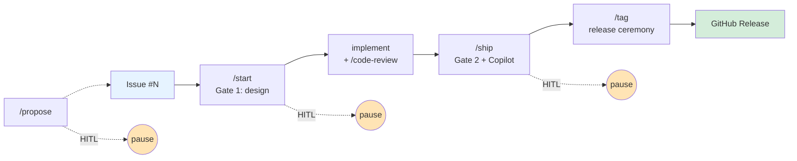

# gh-issue-driven

[](https://github.com/JFK/gh-issue-driven/releases)
[](https://github.com/JFK/gh-issue-driven/actions/workflows/lint.yml)
[](LICENSE)

**English** | [日本語](README.ja.md)

> **Full-lifecycle GitHub-issue-driven dev workflow: `propose` issues from session context, design-gated `start`, advisor + Copilot-gated `ship` with HITL confirmation at every phase boundary, ceremony-automated `tag` — with multi-issue batch support, pluggable post-PR reviewer, and per-repo Kagura Memory auto-detect.**

`gh-issue-driven` is a [Claude Code](https://claude.com/claude-code) plugin — but think of it as an **orchestration harness**: a thin meta-layer that wires Claude Code's own skills and agents (design advisors, memory recall, `/code-review`, Copilot) into one governed, repeatable issue → release pipeline with a human-in-the-loop checkpoint at every phase boundary. It's **not** a code generator or a single command — it's the layer that *coordinates* those skills with governance gates and memory.

It turns "I'm starting work on issue #142" into a single, repeatable three-phase workflow:



1. **`/gh-issue-driven:start <issue...>`** — fetch the issue(s), recall related past work from Kagura Memory, run a **gate 1** design review (`/claude-c-suite:ask` cascading to `/ceo` for complex issues), create a typed feature branch, and hand off for implementation. Pass multiple IDs to batch issues into one branch.
2. _(you write the code, then run `/code-review` to review the working-tree diff — the pre-PR review, before `/ship` opens a PR)_
3. **`/gh-issue-driven:ship`** — run a **gate 2** parallel review battery (`cso` + `qa-lead` + `cto` advisors by default; an optional binary release gate can be configured via `gate2.binary_gate`), create the PR, and drive a **pluggable post-PR review loop** (Copilot, `/code-review`, or both — configurable via `review.provider`) until the PR is approved or no actionable feedback remains. A **HITL confirmation gate** pauses before the Copilot loop starts, so you can decide whether to invoke it for this PR.
4. **`/gh-issue-driven:tag <version>`** — release ceremony: compose label-grouped release notes from the milestone, bump `plugin.json` + `marketplace.json`, update `CHANGELOG.md`, commit, annotated-tag, push with `--follow-tags`, and create the GitHub Release. `dry-run` previews everything without touching files, git, or GitHub.

The whole flow is bracketed by `kagura-memory` `session-start` and `session-summary` with **auto-detect context setup** on first run, so each issue's learnings get persisted for future recall.

> 📖 **Read the design philosophy**: [Qiita article — Issue→Release を自動化したら、逆に人間が重要になった話](https://qiita.com/kiyotaman/items/302c8b7dc2cbcec555ff) · [Slides](https://docs.google.com/presentation/d/1eVUJLepOofN5bJUC7GBK7grPgTqRdfge5Ft9izaK8k4/edit)

---

## 60-second quickstart

```text
# Step 0 — one-time, in your repo's GitHub Settings page:
#   Settings → Code review → ☑ Automatic Copilot code review
#   URL: https://github.com/<owner>/<repo>/settings/code-review
#   This makes the Copilot review loop work on any gh CLI version.
#   Without it, you need gh CLI >= 2.88.0 (see Requirements below).

# In any Claude Code session — install the plugin:
/plugin marketplace add JFK/gh-issue-driven
/plugin install gh-issue-driven

# Recommended companion plugins (gracefully degrade if missing).
# Note: the install target's `@<marketplace>` is the marketplace NAME from
# its marketplace.json, not the GitHub repo slug.

/plugin marketplace add JFK/claude-c-suite-plugin    # gate1 + gate2 reviewers
/plugin install claude-c-suite@claude-c-suite

/plugin marketplace add kagura-ai/memory-cloud       # session-start/summary + recall
/plugin install kagura-memory@kagura-memory-cloud

# Optional (reserved for v0.2 deep-review modes):
/plugin marketplace add JFK/claude-phd-panel-plugin
/plugin install claude-phd-panel@claude-phd-panel

# In a repo:
/gh-issue-driven:doctor          # one-time environment check (will prompt to confirm Step 0)
/gh-issue-driven:start 142       # phase 1 (single issue)
/gh-issue-driven:start 4 12 20   # or batch multiple issues into one branch
# ... implement, then /code-review to review the diff ...
/gh-issue-driven:ship            # phase 2 (gate2 + Copilot loop)
# ... after PR is merged, when the milestone is ready ...
/gh-issue-driven:tag 0.3.0 dry-run   # phase 3 preview
/gh-issue-driven:tag 0.3.0           # phase 3 execute (release ceremony)
```

> **Why Step 0 matters**: GitHub's "Automatic Copilot code review" repo setting auto-requests Copilot's review on every PR open and every push, making the loop self-sustaining on any `gh` version. Without it, the plugin falls back to `gh pr edit --add-reviewer @copilot`, which **silently no-ops** on `gh < 2.88.0` (see [#15](https://github.com/JFK/gh-issue-driven/issues/15)). `/gh-issue-driven:doctor` will prompt you to confirm Step 0 once per 7 days per repo and hard-fail if neither path is available.

---

## Commands

| Command | Phase | What it does |
|---|---|---|
| `/gh-issue-driven:start <issue...> [flags]` | 1 | Fetch issue(s), run gate 1, create branch. Pass multiple IDs to batch. Flags: `dry-run`, `force`, `no-memory`, `--branch=<name>`. |
| `/gh-issue-driven:ship [flags]` | 2 | Run gate 2, create PR, HITL gate, drive Copilot loop, save session memory. Flags: `dry-run`, `force`, `no-copilot`, `draft`, `auto-skip`, `--review=code-reviewer`. |
| `/gh-issue-driven:review [flags]` | 2 | Re-run the post-PR review loop on an already-open PR (Copilot, `/code-review`, or both). Re-entrant by design. Flags: `dry-run`, `force`. |
| `/gh-issue-driven:tag <version> [flags]` | 3 | Release ceremony: compose release notes, bump manifests, update `CHANGELOG.md`, commit, annotated-tag, push, create GitHub Release. Flags: `dry-run`, `force`, `--notes-file=<path>`. |
| `/gh-issue-driven:propose <description> [flags]` | 0 | Draft and file a new issue: dedup check, quality review, PM enrichment, HITL confirmation. Flags: `dry-run`, `force`. |
| `/gh-issue-driven:goal <milestone> [flags]` | G | **Drive a whole milestone to PR**: for each open issue, run `start` → implement → `/code-review` → `ship` (gate2 + PR + Copilot loop + session-summary), checkpointing to resumable state between issues. Gates on **red** verdicts (HITL); green/yellow auto-continue. _(Fully unattended green/yellow — suppressing the delegated `start`/`ship` prompts — is being wired in #74; until then those sub-command prompts still appear.)_ Never merges, never pushes to the default branch. Flags: `dry-run`, `force`, `resume`. |
| `/gh-issue-driven:doctor [verbose\|fix]` | — | Read-only environment health check. |
| `/gh-issue-driven:config [show\|init\|path\|<key>]` | — | Show effective config or stamp a fresh template. |
| `/gh-issue-driven:status [<branch>\|all\|proposals]` | — | Show gh-issue-driven state for a branch (or all branches, or saved proposals). |

---

## How the three phases work

### Phase 1 — `/gh-issue-driven:start` (Gate 1: design review)

Runs **after** the issue is fetched and recall is done, **before** the branch is created. Strategy:

1. Invoke `/claude-c-suite:ask` first — a single-lens auto-router. Cheap, fast, perfect for issues that need only one expert perspective.
2. If the last `## Verdict:` line's token is `decline`, escalate to `/claude-c-suite:ceo` for full 3-lens synthesis. (`decline` is an additional gate1-only token on the same `## Verdict:` line, not a separate channel — only the structured line counts. Free-form mentions of "decline" or "escalate" inside the analysis body are part of the reviewer's reasoning, not routing instructions.)
3. Parse the verdict from a `## Verdict: green|yellow|red` line at the end of the reviewer's response. The structured line is canonical and last-wins; case is normalized; trailing punctuation is tolerated. A keyword heuristic is the **fallback only** when no structured line is present, and emits a warn-level log so soft-deprecation can be tracked.
4. **green** → HITL confirmation gate (asks the user to confirm before creating the branch; configurable via `gate1.green_continue_requires_confirm`, default `true`). **yellow** → ask the user to confirm. **red** → abort unless `force`.

### Phase 2 — `/gh-issue-driven:ship` (Gate 2: pre-PR review battery + Copilot loop)

Runs **after** the implementation, **before** the PR is created. By default, **3 advisor reviewers** fire in parallel in a single Claude turn (advisor-only mode):

| Reviewer | Role | Verdict type |
|---|---|---|
| `/claude-c-suite:cso` | Security | Advisory (`green`/`yellow`/`red`) |
| `/claude-c-suite:qa-lead` | Test coverage | Advisory |
| `/claude-c-suite:cto` | Tech debt | Advisory |

The three advisor verdicts are aggregated: any red → red, any yellow → yellow, otherwise green. Verdict handling matches gate1 (green → HITL confirmation gate before PR creation, configurable via `gate2.green_continue_requires_confirm`, default `true`; yellow → confirm; red → abort unless `force`).

#### Optional binary gate (off by default)

Plugin maintainers who want a **hard binary gate** (a `pass`/`fail` reviewer that blocks PR creation even with `force`) can configure one via `gate2.binary_gate` in `~/.claude/gh-issue-driven-config.json`:

```json
{
  "gate2": {
    "binary_gate": "/claude-c-suite:audit"
  }
}
```

When set, the configured skill is invoked alongside the 3 advisors as a 4th reviewer. Its verdict (`pass`/`fail`) is read as a hard release gate.

The default is `null` (no binary gate). Earlier versions defaulted to `/claude-c-suite:audit`, but that skill is the conformance script for the `claude-c-suite` plugin's own command files — it errors out on any other plugin and previously blocked every `/ship` invocation in non-claude-c-suite-plugin repos. The fix landed in v0.1.1 (#26).

### Phase 3 — `/gh-issue-driven:tag` (release ceremony)

Runs **after** the PR has been merged into the default branch and the milestone is ready. The ceremony is deliberately structured so that **all checks run before any file mutations** — if anything fails, the working tree stays clean:

1. **Pre-flight**: default branch? clean worktree? up-to-date with remote?
2. **Milestone readiness**: the milestone matching the version has no open issues (or `force` to override with a loud warning).
3. **Lint + tests**: `check-frontmatter.py` and any `tests/*.sh` run before touching files.
4. **Compose release notes**: milestone's closed issues are grouped by label (`bug` → "Bug Fixes", `enhancement` → "Enhancements", etc. via `tag.label_group_map`) with an auto-generated "Full Changelog" compare link.
5. **Bump manifests**: `.claude-plugin/plugin.json` and `.claude-plugin/marketplace.json` via the Edit tool (not sed — for traceability). Fails loud if the two files are out of sync before the bump.
6. **Update `CHANGELOG.md`**: prepend a dated entry linking to the GitHub Release page.
7. **Commit**: `chore: release v<version>` (the three release files only).
8. **Annotated tag**: `git tag -a v<version>` (annotated is required so `--follow-tags` picks it up).
9. **Push**: `git push --follow-tags origin <default_branch>` — commit and tag together, no partial-failure window.
10. **Create GitHub Release**: `gh release create v<version> --notes-file ...` using the composed notes.

Use `dry-run` to preview every step (release notes content, manifest diff, CHANGELOG entry, git command list) without touching files, git, or GitHub. This is the only command in the plugin that pushes to the default branch — every other command forbids that.

If `git push` is rejected by branch protection, the command does not loop or retry. Instead, it prints a **recovery workflow** that preserves the already-created local commit and tag, walking you through a short-lived PR for the version bump so you don't lose work or re-run the destructive steps.

### Verdict line convention

Reviewer skills must end their response with a final `## Verdict:` line. The token must be one of:

- `## Verdict: green`
- `## Verdict: yellow`
- `## Verdict: red`
- `## Verdict: decline`  &nbsp;&nbsp;— gate1 (`/ask`) only; routing escalation signal
- `## Verdict: pass`  &nbsp;&nbsp;— `/audit` only
- `## Verdict: fail`  &nbsp;&nbsp;— `/audit` only

(If multiple `## Verdict:` lines appear in the response, last-wins applies — see Rules below.)

Rules:

- **The structured line is canonical.** `gh-issue-driven` parses this line first.
- **Last-wins**: if multiple `## Verdict:` lines appear in the response, the **last** occurrence is used (so reviewers can naturally write "at first I thought red, but actually green").
- **Case insensitive**: `Green` / `green` / `GREEN` all normalize to `green`.
- **Trailing punctuation tolerated**: `## Verdict: green.` is accepted (`\b<token>\b` regex).
- **Heuristic is fallback only**: if no structured line is present, a keyword heuristic runs and emits a `verdict_parser=heuristic` warn log so its usage can be tracked toward eventual removal in v0.4.
- **`decline` is gate1-routing-only**: it's a valid value on the same `## Verdict:` line for gate1 responses, not a separate channel. Free-form mentions of "decline" inside the analysis body are reviewer reasoning, not routing signals.

If you maintain a `claude-c-suite` or `claude-phd-panel` reviewer skill, emitting this line on every reviewer response is the cleanest integration.

---

## Parallel development (`--worktree`)

`/gh-issue-driven:start <issue> --worktree` creates the feature branch inside a separate [git worktree](https://git-scm.com/docs/git-worktree) instead of checking out in-place. This lets you keep the main working tree on `main` (or on another feature branch) while implementation proceeds in the new one. (Flag order matters — `start` parses issue identifiers first, then flags, so `--worktree` comes *after* the issue.)

### Two paths, same flag

- **With `superpowers` plugin installed**: delegates to `superpowers:using-git-worktrees`, which performs smart directory selection outside the repo (typically a sibling path).
- **Without `superpowers`**: fallback creates `.worktrees/<branch>` inside the repo. The directory should be gitignored via `/.worktrees/`; running `/gh-issue-driven:doctor fix` prints an idempotent `try:` command to append that entry, which the operator runs manually (doctor itself is read-only and never edits files). When combined with `--branch=<override>`, the fallback places the worktree at `.worktrees/<override>`.

In both cases, the `start` recap prints a `cd <worktree-path>` hint so you land in the new worktree on your next shell prompt.

### Lifecycle — clean up after merge

A worktree is not automatically removed when the PR is merged. After merging and pulling `main`, run:

```bash
git worktree remove <worktree-path>
git worktree prune   # cleans up any stale registrations
```

If you manually `rm -rf` the directory first (don't), `git worktree prune` alone is enough to clear the dangling registration.

### When to use `--worktree` vs calling superpowers directly

- **Use `start --worktree`** when you want the worktree tied to this plugin's 3-phase flow (`start → ship → tag`) — branch name, state file, and gate1 summary all land in the expected places for the new branch.
- **Invoke `superpowers:using-git-worktrees` directly** when you want a worktree for something outside this plugin (reviewing an arbitrary branch, experimenting, etc.) — no state file, no gate1 review.

---

## Token-efficient flags (`auto-size`, `auto-skip`, `--with-plan`, `--parallel`)

`/start` and `/ship` accept opt-in flags that adapt the cascade to the actual scope of the work. Defaults are unchanged — when no flags are passed, behavior is byte-identical to v0.8.0.

### `auto-size` — skip gate1 for small issues (`/start`)

`/gh-issue-driven:start <issue> auto-size` invokes the **issue-size heuristic**: if the primary issue's labels match `gate1.size_heuristic.small_labels` (default `good first issue`, `documentation`, `docs`, `tests`, `i18n`) **or** the body is shorter than `small_body_max_chars` (default 500), gate1 is **skipped entirely**. No `/claude-c-suite:ask` invocation, no escalation. The state file records `gate1.reviewer="size-heuristic"` and a synthetic verdict markdown.

The HITL confirmation gate still fires so you can override the skip with "I have feedback". Batch invocations (`/start 4 5 6`) are never small — bundling is itself a coherence signal.

To make this the default for every `/start` run, set `gate1.size_heuristic.enabled: true` in `~/.claude/gh-issue-driven-config.json`.

### `auto-skip` — skip irrelevant gate2 advisors (`/ship`)

`/gh-issue-driven:ship auto-skip` probes the diff and, when every changed file matches `gate2.diff_scope_skip.docs_only_patterns` (default `README*`, `CHANGELOG*`, `CONTRIBUTING*`, `docs/`, `.github/`), skips the advisors listed in `docs_only_skip_advisors` (default `cso` and `qa-lead`). The remaining advisors (e.g. `cto`) still run, and the binary gate (`gate2.binary_gate`) is never affected.

A diff that touches even one non-doc file disqualifies docs-only treatment — there is no partial skip. The `commands/*.md` files in this repo are markdown-as-code and are intentionally **not** in the default pattern list.

Persistent equivalent: set `gate2.diff_scope_skip.enabled: true` in config.

### `--review=code-reviewer` — swap the gate2 cascade for the code-reviewer agent (`/ship`)

`/gh-issue-driven:ship --review=code-reviewer` **replaces** the gate2 advisor cascade (`cso` + `qa-lead` + `cto`) with a single invocation of the `feature-dev:code-reviewer` agent. The agent has its own context window (it reads changed files via its own tools, not just the prompt-embedded diff), uses confidence-based filtering, and covers bugs/security/quality/conventions in one pass — a faster, code-quality-focused alternative to the governance-lensed cascade.

- **Verdict**: the agent's output is mapped `fail` if it contains high-priority markers (`must fix`, `blocker`, `critical`, `high-priority`), else `pass`. `pass` → green (HITL gate still applies); `fail` → red (aborts PR creation unless `force`).
- **Orthogonal to `auto-skip`**: if both are set and the diff is docs-only, `auto-skip` wins (the stricter omission — docs-only needs no heavyweight review).
- **Graceful degradation**: if the `feature-dev` plugin (which provides the agent) is not installed, `/ship` warns and falls back to the normal gate2 cascade — never a silent skip. Run `/gh-issue-driven:doctor` to check availability.
- The `--review=` syntax is reserved for future reviewer targets.

### `--with-plan` — generate an implementation plan after gate1 (`/start`)

`/gh-issue-driven:start <issue> --with-plan` invokes `superpowers:writing-plans` after the gate1 verdict and before branch creation. The plan markdown is captured from the conversation and persisted to `~/.claude/cache/gh-issue-driven/<branch-flat>.plan.md`; the state file's `plan.path` points to it.

Requires the `superpowers` plugin. Without it, `/start` logs a warning and continues without a plan (no abort).

The plan is **produced in-line** as part of the `/start` conversation — the same execution model as `/claude-c-suite:ask` and `/kagura-memory:session-start`. There is no autonomous sub-process.

### `--parallel` — implementation via subagent dispatch (`/start`)

`/gh-issue-driven:start <issue> --with-plan --parallel` chains `superpowers:subagent-driven-development` after plan generation: step 18's continue target is set to invoke subagent dispatch on the plan content, rather than launching `/feature-dev:feature-dev` or drafting an implementation outline in the conversation.

`--parallel` requires `--with-plan` (the subagent skill consumes a plan as its input). Setting `--parallel` alone is rejected with an error so the workflow stays explicit.

### When NOT to use these flags

- **`auto-size` + complex issue**: if you set `auto-size` globally and the heuristic misclassifies a complex issue as small, gate1 is skipped without ceremony. The HITL gate is your safety net — override the skip and re-run if needed.
- **`auto-skip` + security-sensitive docs**: if your `docs/` directory contains published threat models or anything that warrants security review on edit, keep the default `false` and re-add `cso` manually for those PRs.
- **`--parallel` for trivial changes**: subagent dispatch has its own setup cost. For one-file fixes, the in-conversation continue target ("draft a plan now") is cheaper.
- **`--review=code-reviewer` for governance-sensitive changes**: the code-reviewer agent is code-quality-focused, not governance-lensed. When a change needs the security/QA/architecture *governance* perspectives (`cso`/`qa-lead`/`cto`), keep the default cascade.

---

## Copilot review loop

After `gh pr create`, `/gh-issue-driven:ship` fires the reviewer add and pauses at a **HITL confirmation gate** (since v0.3.0) before entering the polling loop:

```text
Copilot review on PR #<num>
https://github.com/<owner>/<repo>/pull/<num>

Is Copilot review running on this PR?
  1) Yes, it's running (or I triggered it another way)
  2) No, skip the review loop for this run
  3) Retry — let me trigger it now (I'll press Yes when ready)
```

The plugin cannot verify from outside whether Copilot actually accepted the `--add-reviewer` call — org permissions, Copilot billing/policy, Mode A toggle, manual comment-mention triggers, and draft-PR unreliability are not API-queryable. Rather than grow a detection matrix, the plugin asks you. If the PR is a draft, the prompt also surfaces the draft-PR unreliability caveat so you can pre-emptively decline and promote first.

On **Yes**, the plugin enters the polling loop (up to **5 iterations**, configurable):

1. Wait for new Copilot activity (poll `gh pr view --json reviews,comments,reviewDecision` every 60s, max 15min).
2. Parse the latest review and any new bot comments.
3. **Exit conditions**: `approved`, `no_actionable_feedback`, `max_loops`, `tests_failed`, or `silent_no_op` (now means "confirmed but did not respond" — a genuine anomaly, not a catch-all).
4. Apply actionable comments via `Edit`/`Bash`. Skip nits.
5. Run local tests if `copilot.run_tests_after_edits` is true.
6. Commit `fix: address Copilot review (loop N)`, push, re-request review.

On **No**, the plugin writes `exit_reason="hitl_declined"` to the state file, keeps the PR as draft, and skips the loop cleanly. When you're ready (e.g., after triggering Copilot via the Web UI or promoting from draft), re-enter the loop with `/gh-issue-driven:review` — the gate re-prompts because the decline was "skip this run", not "never ask again".

On **Retry**, the same prompt re-displays immediately. The plugin does not poll or wait between re-emits — you self-pace (trigger Copilot through whatever path you have, then press Yes when ready).

The loop is **never blocking**: if it exhausts 5 iterations, the PR stays open and you handle remaining feedback manually.

### Disabling the HITL gate

Set `copilot.hitl_confirm_invocation: false` in `~/.claude/gh-issue-driven-config.json` to restore the pre-v0.3.0 behavior (no prompt, loop enters directly after the `--add-reviewer` fire-and-forget). Useful for CI or non-interactive environments where the operator cannot respond to the prompt.

### Requirements (one of)

The Copilot loop has **two operational modes**. **One must be true** for the loop to function end-to-end:

- **Mode A (recommended)** — `Settings → Code review → ☑ Automatic Copilot code review` enabled at the repo level. Works on any `gh` CLI version. Copilot is auto-requested on every PR open and on every push.
- **Mode B** — `gh` CLI **v2.88.0 or later** (the version that added real `--add-reviewer @copilot` support per the [March 2026 changelog](https://github.blog/changelog/2026-03-11-request-copilot-code-review-from-github-cli/)). Earlier `gh` versions silently no-op the manual reviewer add — see [#15](https://github.com/JFK/gh-issue-driven/issues/15).

Both also require: the repo must have GitHub Copilot code review feature available on its plan.

### Manual Web UI fallback

If you can't enable Mode A AND can't upgrade `gh` to 2.88.0+:

1. After the plugin creates the PR, the HITL gate prompts you.
2. Open the PR in the GitHub Web UI → Reviewers → click "Copilot".
3. Press **Yes** when the HITL prompt re-displays (or choose **Retry** first, trigger Copilot, then press Yes).

---

## Cross-plugin Skill invocation contract

This plugin invokes other plugins' slash commands as **skills** (via Claude Code's Skill tool). For each gate, the command body explicitly tells Claude:

> Invoke `/claude-c-suite:ask` via the Skill tool, passing the prompt block built in step N as input. Wait for the full markdown response before continuing.

For parallel reviewers in gate2 (the number of skills invoked depends on `gate2.binary_gate`):

> In a single tool-call batch, invoke the gate2 reviewer skills in parallel via the Skill tool. **Default (advisor-only mode, `gate2.binary_gate: null`)**: 3 advisor skills — `/claude-c-suite:cso`, `/claude-c-suite:qa-lead`, `/claude-c-suite:cto`. **When `gate2.binary_gate` is configured to a skill name** (e.g. `/claude-c-suite:audit` for plugin maintainers): 4 skills — the configured binary gate skill plus the 3 advisors.

If a skill is not installed, the command degrades:
- Missing advisor reviewer → that gate slot becomes `unknown`, prints a warning, continues.
- Missing binary gate skill (only when `gate2.binary_gate` is set) → treat as `unknown`, require `force` to continue.
- `gate2.binary_gate` is `null` (default) → no binary gate, advisor-only mode, no `force` required.
- Missing `kagura-memory` → recall and session-start/summary are skipped (with a one-line warning when `memory.context_id` resolution fails).

You can probe what's installed with `/gh-issue-driven:doctor`.

---

## Configuration

Defaults are baked in. Override at `~/.claude/gh-issue-driven-config.json`:

```bash
/gh-issue-driven:config init      # writes the template (only if absent)
/gh-issue-driven:config show      # show effective merged config
/gh-issue-driven:config path      # print the file path
/gh-issue-driven:config copilot.max_loops   # print one value
```

Key options:

| Key | Default | Notes |
|---|---|---|
| `default_branch` | `main` | The branch `start` and `ship` use as the base. |
| `branch.type_label_map` | bug/fix/feature/... → fix/feat/... | How issue labels become branch type prefixes. |
| `memory.context_id` | `null` (auto-detect) | Kagura Memory context for recall. Accepts `null` (auto-detect per repo), a **dict** keyed by `owner/repo` (e.g. `{"JFK/gh-issue-driven": "<uuid>", "*": "<uuid>"}` — `"*"` is a wildcard fallback), or a legacy scalar UUID/name. On first `/start` in a repo, the user is prompted to select or create a context; the choice is persisted under the repo's key. See `/gh-issue-driven:config show` for the full semantics. |
| `gate1.primary` | `/claude-c-suite:ask` | First reviewer in the gate1 cascade. |
| `gate1.fallback` | `/claude-c-suite:ceo` | Used when primary declines. |
| `gate1.green_continue_requires_confirm` | `true` | Pause for HITL confirmation on green gate1 verdict before branch creation. Set to `false` to continue silently. |
| `gate2.binary_gate` | `null` (off) | Optional override-blocking binary gate. Set to a skill name (e.g. `/claude-c-suite:audit`) to enable. |
| `gate2.green_continue_requires_confirm` | `true` | Pause for HITL confirmation on green gate2 verdict before PR creation. Set to `false` to continue silently. |
| `gate2.advisors` | `[cso, qa-lead, cto]` | Run in parallel; aggregated. |
| `copilot.max_loops` | `5` | Maximum review iterations. |
| `copilot.poll_interval_sec` | `60` | Time between `gh pr view` polls. |
| `copilot.max_wait_sec` | `900` | Max wait per loop iteration (15 min). |
| `copilot.run_tests_after_edits` | `true` | Run local tests after applying Copilot suggestions. |

### Optimizing the Copilot review loop

The Copilot loop works out of the box, but two optional tuning steps can reduce review round-trips by ~50%:

1. **Turn off "Review new pushes"** in your repo's code-review settings (`Settings → Code review → ☐ Review new pushes`). The plugin re-requests review via `gh pr edit --add-reviewer @copilot` after each fix commit — automatic re-reviews on every push cause duplicate rounds.

2. **Add `.github/copilot-instructions.md`** to tell Copilot what matters in your project:

   ```md
   ## For pull request reviews

   ### Priority
   - Report only high-signal issues: correctness bugs, security vulnerabilities,
     data loss risks, concurrency problems, performance regressions, broken tests.
   - Skip pure style nits unless they mask a real bug.

   ### Consolidation
   - Group similar findings into one comment with all locations listed.
   - If more than 5 issues found, report only the top 5 by severity.
     Mention the count of lower-priority items in a summary line.

   ### Project conventions
   <!-- Add your project-specific conventions here, e.g.:
   - This project uses Tailwind CSS. Do not suggest CSS modules.
   - All user-facing strings must use next-intl.
   -->
   ```

   Copilot reads the first 4,000 characters. See: [Customizing Copilot code review](https://docs.github.com/en/copilot/how-tos/use-copilot-agents/request-a-code-review/use-code-review)

`/gh-issue-driven:doctor` will show an informational note if the file is missing.

---

## State files

Each branch tracked by `gh-issue-driven` has a state file at:

```text
~/.claude/cache/gh-issue-driven/<branch-with-slashes-replaced>.json
```

Plus full reviewer output:

```text
~/.claude/cache/gh-issue-driven/<branch-flat>.gate1.md
~/.claude/cache/gh-issue-driven/<branch-flat>.gate2.md
```

`/gh-issue-driven:status` reads these and pretty-prints the current phase, gate verdicts, PR link, and Copilot loop state.

---

## Required dependencies

| Tool | Required | Why |
|---|---|---|
| `gh` (any version) | yes | issue/PR ops. **Mode A**: any version. **Mode B**: v2.88.0+ required (real `--add-reviewer @copilot` support landed in March 2026 — see [Requirements](#requirements-one-of) above for the Mode A vs Mode B distinction). |
| `git` | yes | branch ops |
| `jq` | yes | JSON parsing in command bodies |
| `python3` | recommended | helper for some checks |
| [`claude-c-suite`](https://github.com/JFK/claude-c-suite-plugin) | recommended | gate1 + gate2 reviewers (degrades gracefully) |
| [`claude-phd-panel`](https://github.com/JFK/claude-phd-panel-plugin) | optional | reserved for v0.2 deep-review modes |
| [`kagura-memory`](https://github.com/kagura-ai/memory-cloud) | optional | session-start/summary + recall |

---

## Trying it out

The plugin includes a recommended end-to-end test workflow. In a throwaway test repo, open three issues:

- **Issue A** — trivial typo fix (e.g. README typo). Expected: `gate1=green` via `/ask`, fastest path.
- **Issue B** — medium feature ("add input validation to function X"). Expected: `gate1=yellow` with suggestions, mixed `gate2` advisor verdicts.
- **Issue C** — cross-cutting redesign. Expected: `/ask` declines → `/ceo` synthesis, `gate2 audit` may fail until conformance is fixed.

For each:

1. `/gh-issue-driven:doctor`
2. `/gh-issue-driven:start <id> dry-run` (verify no side effects)
3. `/gh-issue-driven:start <id>` (real run)
4. Implement the fix
5. `/gh-issue-driven:ship dry-run`
6. `/gh-issue-driven:ship`
7. `/gh-issue-driven:status`

---

## Limitations

`gh-issue-driven` has been used to ship its own PRs against `JFK/gh-issue-driven` since v0.1.0 (15+ releases). The following known sharp edges exist as of v0.7.0. None lose data or corrupt state, but they affect the operator experience:

- **Slow Mode A repos can false-positive `silent_no_op`** ([#23](https://github.com/JFK/gh-issue-driven/issues/23)) — `/gh-issue-driven:ship` step 13 has a 30s bounded wait for the first Copilot signal. On repos where GitHub's "Automatic Copilot code review" auto-review takes longer than 30s (observed up to ~4 min on `JFK/gh-issue-driven`), the wait expires and the loop is incorrectly skipped with `exit_reason=silent_no_op`. The state file records the diagnosis correctly; recovery is to re-run `/ship` once the Copilot review lands. Architectural fix tracked in #23 (move detection into step 14's polling loop).
- **`/gh-issue-driven:doctor` does not validate context_id resolution** — the configured `memory.context_id` is resolved at `/start` time, but `/doctor` does not yet check whether it resolves successfully. Tracked as a follow-up.
- **No loop state machine tests** — the verdict parser and Copilot detection function are fixture-driven tested, but the 5 terminal `exit_reason` states in step 14's polling loop are not covered by automated tests yet (tracked in [#10](https://github.com/JFK/gh-issue-driven/issues/10)).
- **`claude-c-suite:audit` cannot evaluate this plugin via its declared mechanism** — the audit skill's `scripts/audit.py` does not exist in `gh-issue-driven`'s layout. The de-facto baseline is `lint.yml` (which validates frontmatter, JSON syntax, version sync, fixture tests, and inline-jq sync).

For the full list of known issues, see the [v0.4.0 milestone](https://github.com/JFK/gh-issue-driven/milestone/6).

---

## Security

See [SECURITY.md](SECURITY.md). TL;DR: this plugin runs `git`, `gh`, and reviewer skills. It never pushes to default branches, never force-pushes, never modifies `~/.claude/settings.json`, and never auto-applies Copilot suggestions without scrutiny.

---

## Development

See [CONTRIBUTING.md](CONTRIBUTING.md).

CI runs `lint.yml` on every push and PR — JSON syntax, version sync, name sync, and command frontmatter parseability.

Before cutting any `v*` tag, maintainers follow the [Release checklist (dogfooding gate)](CONTRIBUTING.md#release-checklist--dogfooding-gate): `patch` releases require 1 representative run, `minor`/`major` releases require 3 runs across typo / mid-size feature / cross-cutting categories, with evidence attached to the release notes.

---

## License

[MIT](LICENSE) © Fumikazu Kiyota

---

🤖 Built with [Claude Code](https://claude.com/claude-code).
